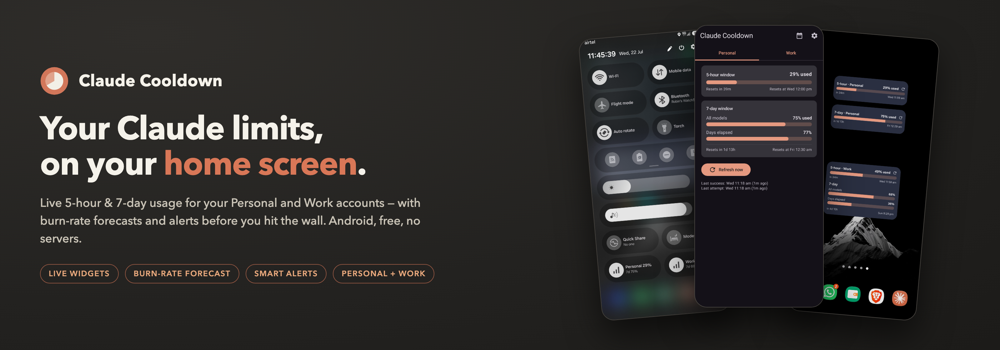
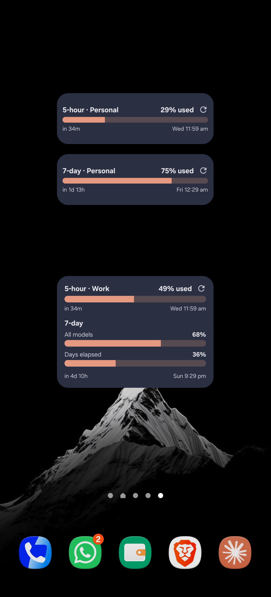
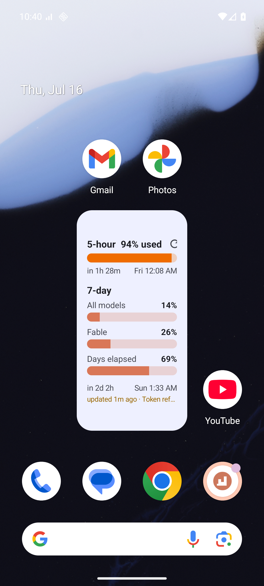
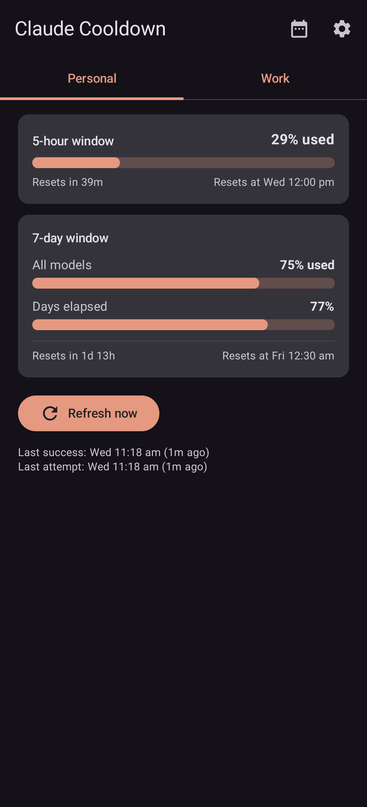
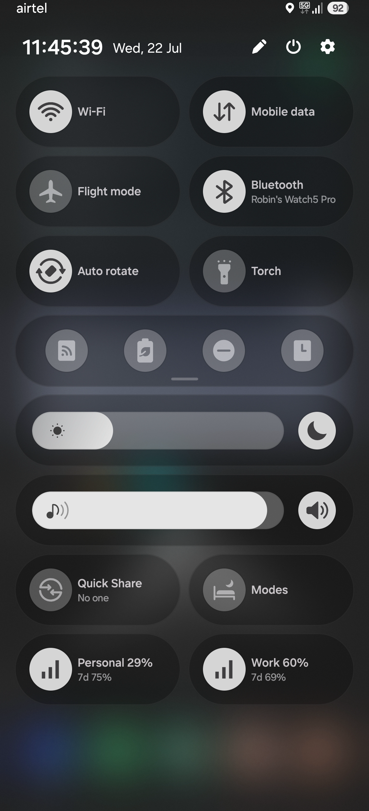
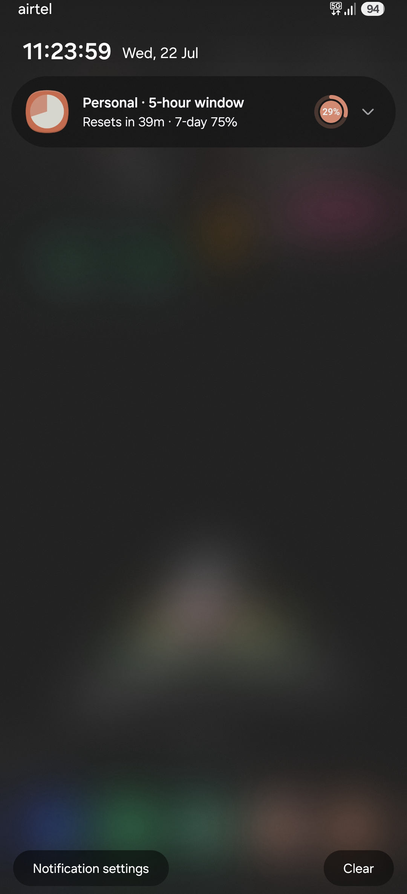
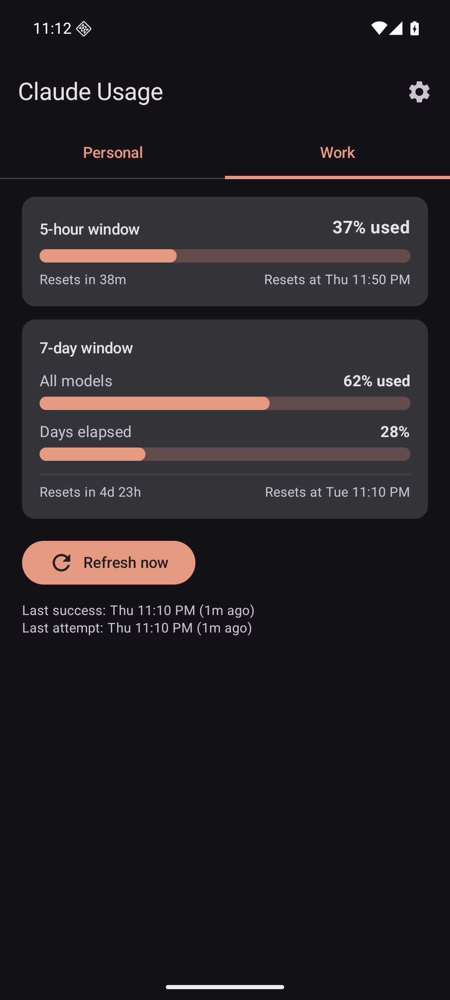

<p align="center">
  
</p>

# CCooldown

**Claude Cooldown** — an Android home-screen widget and app that shows how much of your
Claude Pro / Max / Team usage limits you've burned through, and when your 5-hour and 7-day
windows reset. Built for people who live in Claude Code and keep hitting the wall mid-thought.

**📱 Android only (for now)** — an iOS version is on the roadmap. iPhone folks, watch this space.

> ⚠️ **Unofficial.** This is a personal community tool. It is not affiliated with, endorsed
> by, or supported by Anthropic. "Claude" is a trademark of Anthropic, PBC.

## What it does

- **Home-screen widgets** (small / medium / large, plus a compact single-bar widget) showing
  the 5-hour session window, the 7-day all-models window, and per-model 7-day caps —
  with countdown and exact local reset time
- **Two profiles** — track a Personal and a Work account side by side, in swipeable tabs
- **Quick Settings tiles** — glance at your 5h/7d percentages from the notification shade
- **Alerts** — notifications at 80% / 95% of the 5-hour window and 90% of the 7-day and
  per-model windows, plus an optional "window has reset, Claude is fresh again" notification
- **Burn-rate projection** — a sparkline of each window's usage curve and a plain-words
  forecast ("At this pace: 100% at 2:40 PM — 1h 20m before the reset"), built from a local
  history of your own polls
- **A "days elapsed" pacing bar** — see whether your weekly usage is running ahead of or
  behind the week itself
- **13 theme colors** including Material You dynamic color, full light/dark support

## Screenshots

<table>
  <tr>
    <td align="center"><br><sub><b>Home-screen widget</b> — 5-hour &amp; 7-day windows at a glance</sub></td>
    <td align="center"><br><sub><b>Light theme</b> — follows your system setting</sub></td>
    <td align="center"><br><sub><b>The app</b> — full breakdown with exact reset times</sub></td>
  </tr>
  <tr>
    <td align="center"><br><sub><b>Quick Settings tiles</b> — swipe down, see your %</sub></td>
    <td align="center"><br><sub><b>Alerts</b> — near-limit warnings and "window has reset"</sub></td>
    <td align="center"><br><sub><b>Two profiles</b> — Personal and Work, side by side</sub></td>
  </tr>
</table>

More screenshots (settings, themes, widget setup, token guide) in
[`Release/screenshots/`](Release/screenshots/).

## Get started — about 3 minutes

All you need: your Android phone, and the computer where you're already signed in to
Claude Code.

**1. Install the app.** Grab `CCooldown.apk` from the
[latest release](../../releases/latest) onto your phone and open it (allow "install
unknown apps" if your phone asks).

**2. Put your Claude sign-in on the screen as a QR code.** On a Mac, paste this one line
into Terminal and press Enter:

```bash
npx -y qrcode-terminal "$(security find-generic-password -s 'Claude Code-credentials' -w)"
```

A big QR square appears right in the terminal. (On Windows or Linux? Use the one-liners
below.)

**3. Scan it.** In the app: **Settings → tap "Scan QR" on the account card**, and point
your phone at the screen. That's it — the app starts tracking immediately.

**4. Add a widget.** Long-press your home screen → **Widgets** → pick a **Claude
Cooldown** widget.

> 🔑 That QR code carries your Claude sign-in — it's a password in picture form. Show it
> to your own phone, not to a screenshot, a screen-share, or a colleague.

<details>
<summary><b>Windows / Linux QR one-liners</b></summary>

<br>

Both need Node.js installed (and `jq` on Linux).

**Windows (PowerShell):**

```powershell
(Get-Content "$env:USERPROFILE\.claude\.credentials.json" -Raw | ConvertFrom-Json).claudeAiOauth | ConvertTo-Json -Compress | npx -y qrcode-terminal
```

**Linux:**

```bash
jq -c .claudeAiOauth ~/.claude/.credentials.json | npx -y qrcode-terminal
```

**Troubleshooting:** if you see `code length overflow`, the credentials file is carrying
extra logins (e.g. MCP servers) — filter it down to just the Claude part. On macOS:

```bash
security find-generic-password -s 'Claude Code-credentials' -w | jq -c .claudeAiOauth | npx -y qrcode-terminal
```

If the QR square doesn't fit on screen, shrink the terminal font until it does.

</details>

<details>
<summary><b>No Node.js? Copy-paste method</b></summary>

<br>

You can also move the sign-in as plain text. First, get the JSON on your computer:

- **macOS** — in Terminal: `security find-generic-password -s "Claude Code-credentials" -w`
- **Windows** — open the file `%USERPROFILE%\.claude\.credentials.json` and copy its contents
- **Linux** — open the file `~/.claude/.credentials.json` and copy its contents

Then get that text onto your phone any way you trust — Samsung Link to Windows clipboard
sync, Quick Share, KDE Connect — and paste it into the app's **Settings**. The app accepts
either the whole file or just the inner `claudeAiOauth` object, and refreshes the token
automatically when it expires.

Treat this token like a password — it grants access to your Claude account. Don't send it
through channels you don't trust (email, group chats, cloud notes).

</details>

## How it works

The app calls Anthropic's own usage endpoint (`api.anthropic.com/api/oauth/usage`) — the
same one Claude Code uses — with the OAuth token from your Claude Code sign-in. It polls
on a battery-friendly interval (15 minutes by default, configurable).

**Privacy:** your token stays on your device, encrypted with the Android Keystore
(EncryptedSharedPreferences, AES-256-GCM). It is sent to Anthropic's API and nowhere else.
There are no servers, no analytics, no third-party network calls.

## Build from source

Requirements: JDK 17, Android SDK (compileSdk 36).

```bash
./gradlew assembleDebug
# APK lands in app/build/outputs/apk/debug/
```

Stack: Kotlin, Jetpack Compose (Material 3), Glance for widgets, WorkManager for polling,
OkHttp. No other dependencies.

## Fair-use notes

- The usage endpoint is undocumented; the parser is deliberately lenient and this app may
  break without notice if Anthropic changes it.
- The app only **reads** usage data — it never sends prompts or consumes your quota
  (checking your usage does not count as usage).
- Anthropic's consumer terms restrict the use of consumer OAuth tokens in third-party
  tools. This project exists for personal/educational use — use it at your own discretion.
- Polling is rate-limit-friendly (default 15 min, hard floor of 5 min).

## Feedback

Found a bug or want a feature? Open an issue here, use "Share feedback" in the app's
About section, or [message me on WhatsApp](mailto:robin@eam360.com).

## Credits

Made by **Robin Richard Rajan** · Built with [Claude Code](https://claude.com/claude-code) 🧡

Licensed under the [MIT License](LICENSE). See [RELEASING.md](RELEASING.md) for the
update workflow.
